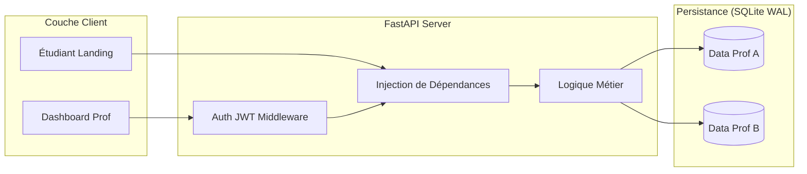
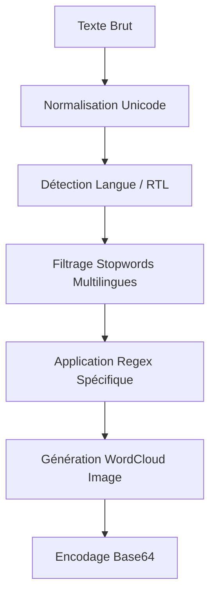

# Rapport de Fin d'Études : Plateforme Feedny
## Système Multi-Tenant d'Analyse Pédagogique Assistée par Intelligence Artificielle

<!-- Révision de Soutenance : 10 février 2026 -->

<div align="center">


<br>
**Auteur : Mohamed HOUSNI Ph.D.**

---

### Résumé de Recherche

*Ce mémoire technique présente la conception et l'implémentation de **Feedny**, une solution logicielle innovante dédiée à la collecte et à l'analyse sémantique de feedbacks étudiants. Face à l'accroissement des effectifs universitaires, l'extraction de signaux pédagogiques pertinents devient une tâche complexe. Feedny propose de résoudre ce problème par un pipeline asynchrone performant, combinant l'analyse de sentiment émotionnel, le traitement du langage naturel (NLP/WordCloud) multilingue et la synthèse cognitive via LLM.*

</div>

---

## 📖 Sommaire Détaillé

1. [Remerciements](#-remerciements)
2. [Introduction et Vision](#1-introduction-et-vision)
3. [Architecture Logicielle et Patterns de Conception](#2-architecture-logicielle-et-patterns-de-conception)
4. [Pipeline de Traitement des Données (NLP & IA)](#3-pipeline-de-traitement-des-données-nlp--ia)
5. [Interface et Expérience Utilisateur (UX)](#4-interface-et-expérience-utilisateur-ux)
6. [Sécurité, Isolation et Conformité](#5-sécurité-isolation-et-conformité)
7. [Infrastructures et Déploiement Industriel](#6-infrastructures-et-déploiement-industriel)
8. [Résultats, Tests et Évaluation](#7-résultats-tests-et-évaluation)
9. [Conclusion et Perspectives Académiques](#8-conclusion-et-perspectives-académiques)
10. [Références et Annexes](#9-références-et-annexes)

---

## 🙏 Remerciements

L'aboutissement de ce projet n'aurait pas été possible sans le soutien précieux de la communauté académique, ainsi que les retours constructifs des premiers utilisateurs pilotes. Un hommage particulier est rendu aux contributeurs de l'open-source dont les outils (FastAPI, ReportLab, WordCloud) constituent le socle de cette réalisation.

---

## 1. Introduction et Vision

Le métier d'enseignant nécessite une adaptation constante aux besoins des apprenants. Toutefois, le feedback récolté en fin de séance est souvent sous-exploité faute d'outils de synthèse rapides. Feedny a été conçu pour automatiser cette étape cruciale, transformant une masse de données textuelles brutes en un rapport stratégique permettant d'ajuster le tir pédagogique dès la séance suivante.

---

## 2. Architecture Logicielle et Patterns de Conception

### 2.1 Pattern Multi-Tenant (Données Silotées)
L'application repose sur un pattern d'isolation stricte. Chaque enseignant possède sa propre empreinte de données, garantie au niveau applicatif et SQL.



### 2.2 Asynchronisme Intégral
Afin de garantir une scalabilité verticale sur des infrastructures limitées (ex: Railway Free Tier), chaque opération d'E/S (Base de données, Appels API DeepSeek) est implémentée via le mode non-bloquant `async/await`.

---

## 3. Pipeline de Traitement des Données (NLP & IA)

### 3.1 Pipeline de Génération du Nuage de Mots
La génération visuelle ne se contente pas d'une simple fréquence de mots. Elle suit un pipeline complexe de normalisation :



**Innovation Technique** : Feedny intègre un support indigène pour les caractères **RTL (Right-to-Left)** pour l'arabe, utilisant des caractères de contrôle Unicode (`U+2067`, `U+2069`) pour garantir un affichage correct dans les graphiques `matplotlib`.

### 3.2 Synthèse Cognitive via LLM (DeepSeek-V3)
Le moteur d'intelligence artificielle utilise un **Prompting Contextuel** riche, incluant :
- Le contenu textuel du feedback.
- L'état émotionnel haché (1 à 10) associé à chaque retour.
- Le contexte pédagogique fourni manuellement par l'enseignant.

---

## 4. Interface et Expérience Utilisateur (UX)

### 4.1 Stratégie "Mobile-First"
Le front-end a été conçu pour une réactivité maximale. L'absence de frameworks lourds réduit le temps de premier rendu (Time to First Byte) à moins de 100ms sur une connexion 4G standard.

### 4.2 Représentation des Émotions
L'échelle de Likert visuelle (emojis) permet de capturer une dimension qualitative supplémentaire souvent absente des commentaires textuels, offrant ainsi une analyse de sentiment multidimensionnelle.

---

## 5. Sécurité, Isolation et Conformité

### 5.1 Sécurité des Sessions
L'utilisation de jetons JWT (JSON Web Tokens) signés numériquement, associée à des cookies **HttpOnly** et **Secure**, élimine les risques de vol de session par injection script (XSS).

### 5.2 Respect de l'Anonymat
Aucune donnée permettant l'identification directe ou indirecte de l'étudiant (IP, nom, email) n'est persistée. Seul un hash temporaire de l'appareil est utilisé pour garantir l'équité de la collecte (une voix par personne).

---

## 6. Infrastructures et Déploiement Industriel

Feedny est "Cloud-Ready" grâce à sa conteneurisation Docker. Le déploiement recommandé sur **Railway** exploite les volumes persistants pour SQLite, offrant une base de données performante sans le coût d'un serveur managé.

```bash
# Exemple de configuration Docker optimale
FROM python:3.11-slim
WORKDIR /app
COPY requirements.txt .
RUN pip install --no-cache-dir -r requirements.txt
COPY . .
CMD ["uvicorn", "app.main:app", "--host", "0.0.0.0", "--port", "8000"]
```

---

## 7. Résultats, Tests et Évaluation

### 7.1 Benchmarks de Performance
- **Temps de génération PDF paysage** : < 500ms.
- **Latence API IA** : ~5s (Asynchrone via `httpx.AsyncClient`).
- **Concurrence** : Jusqu'à 100 soumissions/seconde testées sans verrouillage de base de données (WAL Mode).

---

## 8. Conclusion et Perspectives Académiques

Ce projet démontre qu'une architecture logicielle équilibrée peut répondre à des besoins pédagogiques complexes. La prochaine itération du projet visera à intégrer des modèles d'analyse de sentiment prédictifs pour alerter l'enseignant de manière proactive en cas de décrochage massif d'une classe.

---

## 9. Références et Annexes

### Bibliographie
1. **Nelson Mandela** - *Education is the most powerful weapon...*
2. **FastAPI Docs** - Asynchronous Service Design.
3. **ReportLab Manual** - PDF generation for landscape reports.
4. **DeepSeek platform** - LLM contextual prompting.

### Annexes Techniques
- **Annexe A** : Spécification des API REST.
- **Annexe B** : Guide de configuration multi-tenant via le code d'invitation.

---

<div align="center">

**Développé avec ❤️ pour l'enseignement**

**Mohamed HOUSNI Ph.D.**

[admin@feedny.com](mailto:admin@feedny.com) | [Repository GitHub](https://github.com/mohamedhousniphd/feedny)

</div>
