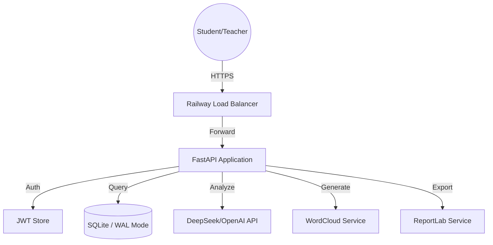

# Feedny - Enterprise-Grade Student Feedback & AI Analysis Platform

<!-- Railway build trigger: updated 2026-02-10 -->

<div align="center">


**A secure, multi-tenant SaaS platform for collecting, analyzing, and synthesizing student feedback using state-of-the-art AI.**

</div>

---

## 📖 Executive Summary

**Feedny** is a modern, mobile-first web application designed for educational institutions to bridge the communication gap between teachers and students. By leveraging advanced AI analysis (DeepSeek/OpenAI), Feedny transforms raw student feedback into actionable pedagogical insights, sentiment analysis, and professional reporting.

### Core Value Proposition

- 🔒 **Privacy-First**: Anonymous feedback collection ensuring student safety and honest responses.
- 👨‍🏫 **Multi-Tenant Architecture**: Independent accounts for teachers with individual dashboards and data silos.
- 🤖 **AI-Driven Insights**: Instant qualitative analysis, word clouds, and sentiment tracking.
- 💎 **Sustainability**: Integrated credit-based monetization and invitation-only growth model.
- 📈 **Scalability**: Dockerized architecture ready for cloud deployment (Railway, Heroku, AWS).

---

## ✨ Features & Modules

### 1. Student Experience (Mobile-First)
- **Anonymous Submission**: No login required for students, protecting their identity.
- **Smart Validation**: 240-character limit with real-time counters.
- **Sentiment Capture**: Optional emoji-based emotion selection to quantify student mood.
- **Spam Protection**: Device-based rate limiting (1 feedback per session).
- **Teacher Codes**: Landing page for entering unique teacher codes to ensure feedback reaches the right recipient.

### 2. Teacher Ecosystem (Multi-Tenant)
- **Secure Authentication**: JWT-based auth with HttpOnly cookies and bcrypt password hashing.
- **Personalized Dashboards**: Individual views for feedback management, stats, and unique teacher codes.
- **Invitation System**: Exclusive signup requirement—new teachers must provide an invitation code from an existing user or admin.
- **Real-Time Analytics**: Live statistics on feedback totals and selection status.

### 3. AI Analysis Suite
- **Intelligent Synthesis**: Deep qualitative analysis using Large Language Models (LLMs).
- **Automated Word Clouds**: Dynamic visual representation of common themes.
- **Professional Reporting**: One-click PDF export containing the summary, word cloud, and statistics.
- **Context Injection**: Teachers can provide lesson context (e.g., "Math class on differential equations") to fine-tune AI accuracy.

### 4. Credit & Monetization System
- **Usage Credits**: AI analysis is managed via a credit system.
- **Bonus Incentives**: Referrers receive credits for successful invitation-based signups.
- **Admin Control**: Centralized interface for manual credit adjustment and teacher management.

---

## 🏗️ Technical Architecture

### Component Diagram



### Directory Structure

```text
feedny/
├── app/
│   ├── main.py                 # Core Application & API Routes
│   ├── auth.py                 # JWT & Password Security Layer
│   ├── database.py             # SQLite Persistence & Migrations
│   ├── models.py               # Pydantic Data Models
│   ├── services/
│   │   ├── wordcloud.py        # NLP & Image Generation
│   │   └── ai_service.py       # LLM Integration (DeepSeek/OpenAI)
│   └── static/                 # Unified Frontend (HTML/JS/CSS)
├── data/                       # Persistent Database Volume
├── Dockerfile                  # Multi-stage Docker Build
├── docker-compose.yml          # Orchestration Config
└── requirements.txt           # Dependency Manifest
```

---

## 🚀 Deployment Guide

### Deployment on Railway (Recommended)

1. **Volume Creation**: In Railway, create a volume mounted at `/app/data` to ensure SQLite persistence.
2. **Environment Variables**:
   - `SECRET_KEY`: Long random string for JWT signing.
   - `ADMIN_INVITE_CODE`: Master code for the first set of signups (Default: `FEEDNY2024`).
   - `DEEPSEEK_API_KEY`: Your AI service key.
   - `DEEPSEEK_BASE_URL`: `https://api.deepseek.com` (or OpenAI equivalent).
3. **Build**: Railway automatically detects the `Dockerfile`.

### Local Development (Docker)

```bash
git clone https://github.com/mohamedhousniphd/feedny.git
cd feedny
cp .env.example .env # Configure your keys
docker-compose up --build
```

---

## 🔒 Security Posture

- **Data Silos**: Each teacher can only access feedbacks associated with their `teacher_id`.
- **Anonymity**: No PII (Personally Identifiable Information) is stored for students. `device_id` is hashed and used only for rate limiting.
- **JWT Security**: Tokens are stored in `HttpOnly` and `SameSite: Lax` cookies to prevent XSS and CSRF attacks.
- **Session Expiry**: Sessions automatically expire after 24 hours.
- **Admin Access**: Critical endpoints (like credit resets) are restricted to teachers with `is_admin = True`.

---

## 📊 API Documentation

### Teacher Auth
- `POST /api/auth/signup`: Requires `name`, `email`, `password`, and `invitation_code`.
- `POST /api/auth/login`: Authenticates teacher and sets secure cookie.
- `POST /api/teacher/logout`: Clears session.

### Feedback Loop
- `POST /api/feedback`: Student submission (requires Valid Teacher Code in cookie).
- `GET /api/feedbacks`: Retrieve teacher-specific feedbacks (Auth required).
- `POST /api/analyze`: Trigger AI synthesis (Auth required, costs 1 credit).

---

## 🛠️ Configuration Options

| Variable | Default | Purpose |
|----------|---------|---------|
| `DATABASE_URL` | `sqlite:///./data/feedny.db` | Persistence layer |
| `MAX_FILE_SIZE` | `5M` | WordCloud image limit |
| `AI_MODEL` | `deepseek-chat` | LLM model selection |
| `CREDITS_PER_SIGNUP` | `3` | Default credits for new users |

---

## 🤝 Contribution & Roadmap

Contributions are welcome! Please follow the standard fork-and-pull-request workflow.

### Current Roadmap
- [ ] Automated payment gateway integration (Stripe/PayPal).
- [ ] Multi-language support (Arabic, English, French).
- [ ] CSV/JSON Data Import for existing records.
- [ ] Email notifications for new feedback bursts.

---

## 📄 License

Distributed under the MIT License. See `LICENSE` for more information.

---

<div align="center">

**Developed and maintained by Mohamed HOUSNI Ph.D.**

[Contact](mailto:admin@feedny.com) | [GitHub](https://github.com/mohamedhousniphd/feedny)

</div>
