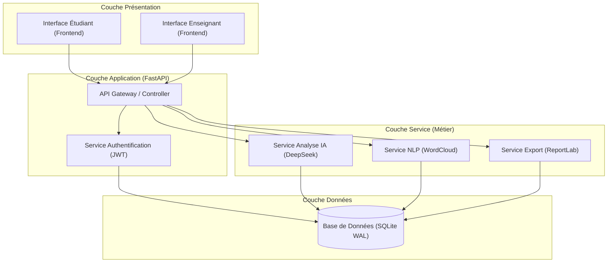
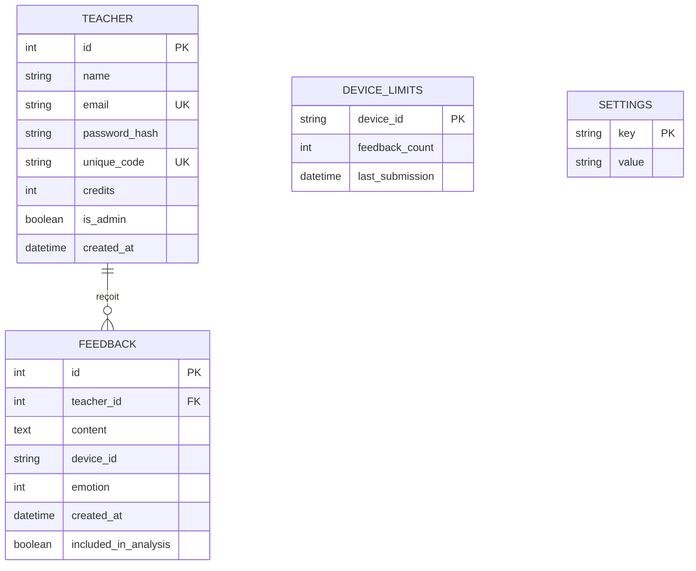
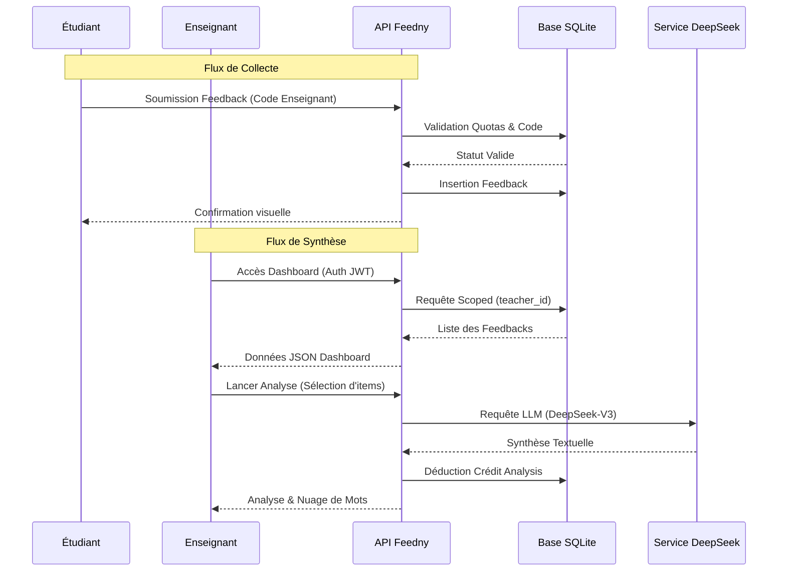
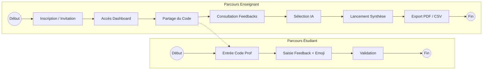
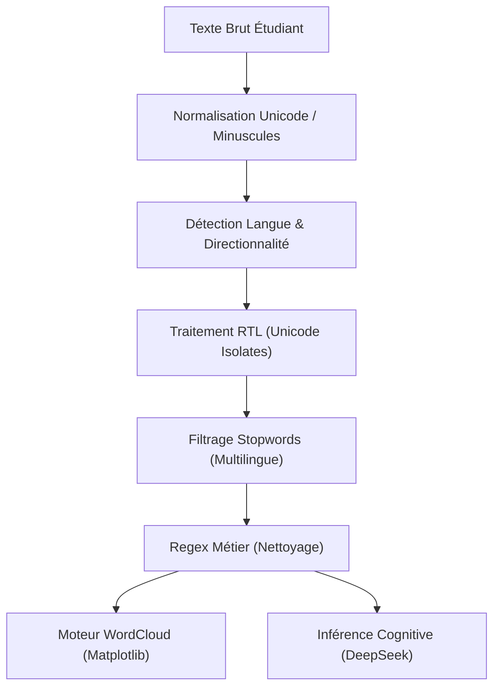
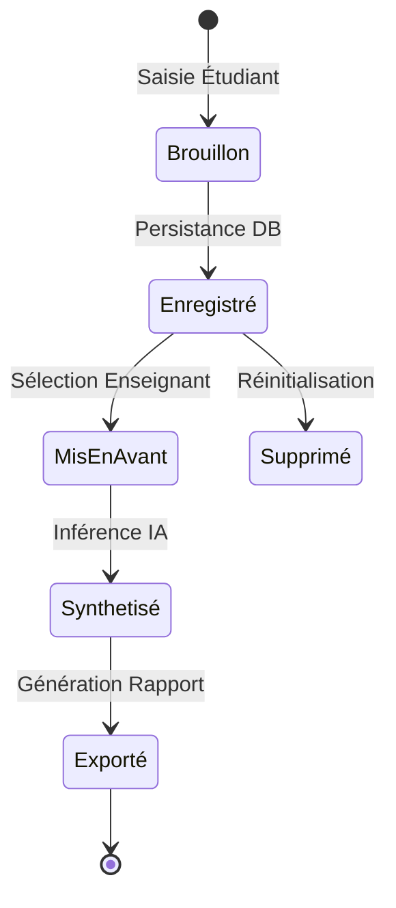
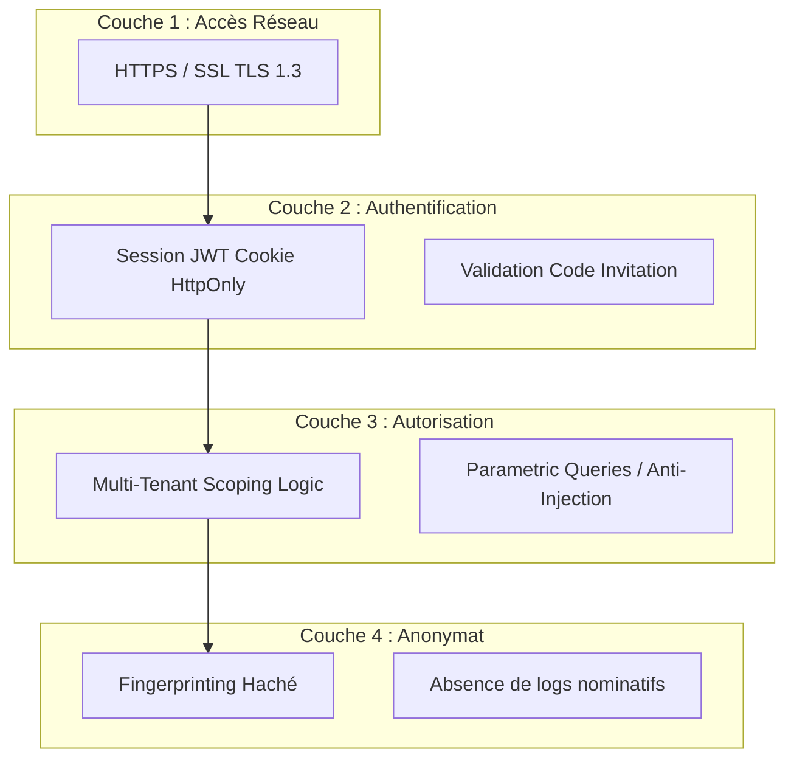
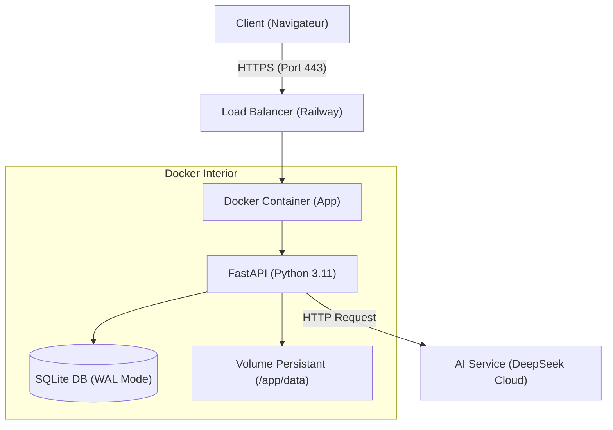

# Rapport Technique de Projet de Fin d'Études : Plateforme Feedny
## Conception et Implémentation d'un Écosystème de Feedback Pédagogique Assisté par IA

<!-- Dernière révision académique : 27 février 2026 -->

 
**Auteur : Mohamed HOUSNI Ph.D.**

---

### Résumé (Abstract)

*Ce rapport détaille la genèse technique et pédagogique de **Feedny**, une plateforme distribuée visant à instaurer un canal de communication bidirectionnel et asynchrone entre l'enseignant et l'apprenant. Dans un monde académique saturé d'informations, la capacité à extraire des signaux significatifs à partir de feedbacks disparates est devenue cruciale. Ce projet allie l'asynchronisme de FastAPI, la robustesse de SQLite en mode WAL, et la puissance cognitive des modèles de langage Large Language Models (LLM) pour offrir une synthèse pédagogique automatisée, sécurisée par une architecture multi-tenancy stricte.*

---

## 📖 Sommaire Détaillé

1. [Remerciements](#-remerciements)
2. [Introduction et Vision](#1-introduction-et-vision)
3. [Architecture Logicielle et Patterns de Conception](#2-architecture-logicielle-et-patterns-de-conception)
4. [Modélisation des Données et Processus (UML/ERD)](#3-modélisation-des-données-et-processus-umlerd)
5. [Parcours et Flux d'Interaction (User Flow)](#4-parcours-et-flux-dinteraction-user-flow)
6. [Pipeline de Traitement des Données (NLP & IA)](#5-pipeline-de-traitement-des-données-nlp--ia)
7. [Étude du Cycle de Vie et d'État](#6-étude-du-cycle-de-vie-et-détat)
8. [Architecture de Sécurité et de Confidentialité](#7-architecture-de-sécurité-et-de-confidentialité)
9. [Interface et Expérience Utilisateur (UX)](#8-interface-et-expérience-utilisateur-ux)
10. [Infrastructures et Déploiement Industriel](#9-infrastructures-et-déploiement-industriel)
11. [Résultats, Tests et Évaluation](#10-résultats-tests-et-évaluation)
12. [Étude de Cas : Résolution des Défis Techniques](#12-étude-de-cas--résolution-des-défis-techniques)
13. [Conclusion et Perspectives Académiques](#13-conclusion-et-perspectives-académiques)
14. [Références et Annexes](#14-références-et-annexes)

---

## 🙏 Remerciements

L'aboutissement de ce projet n'aurait pas été possible sans le soutien précieux de la communauté académique, ainsi que les retours constructifs des premiers utilisateurs pilotes. Un hommage particulier est rendu aux contributeurs de l'open-source dont les outils (FastAPI, ReportLab, WordCloud) constituent le socle de cette réalisation.

---

## 1. Introduction et Vision

Le métier d'enseignant nécessite une adaptation constante aux besoins des apprenants. Toutefois, le feedback récolté en fin de séance est souvent sous-exploité faute d'outils de synthèse rapides. Feedny a été conçu pour automatiser cette étape cruciale, transformant une masse de données textuelles brutes en un rapport stratégique permettant d'ajuster le tir pédagogique dès la séance suivante.

---

## 2. Architecture Logicielle et Patterns de Conception

### 2.1 Pattern Multi-Tenant (Isolation des Données)
L'application repose sur un pattern d'isolation stricte. Chaque enseignant possède sa propre empreinte de données, garantie au niveau applicatif et SQL via des injections de dépendances.

### 2.2 Diagramme de Architecture Technique (Système)
Ce diagramme illustre l'interaction entre les différents modules logiques du serveur.

---

## 3. Modélisation des Données et Processus (UML/ERD)

### 3.1 Diagramme Entité-Relation (ERD)
Le schéma suivant illustre la structure relationnelle garantissant l'isolation des données entre enseignants.

### 3.2 Diagramme de Séquence : Flux de Données Transactionnel
Ce diagramme détaille les échanges transactionnels entre le client, le serveur et les services tiers.

---

## 4. Parcours et Flux d'Interaction (User Flow)

L'expérience utilisateur est segmentée en deux parcours distincts mais interdépendants.

---

## 5. Pipeline de Traitement des Données (NLP & IA)

### 5.1 Processus de Normalisation Textuelle
La génération visuelle et l'analyse IA suivent un pipeline rigoureux de prétraitement pour garantir la pertinence sémantique.

---

## 6. Étude du Cycle de Vie et d'État

### 6.1 Diagramme d'État du Feedback (UML Status)
Ce diagramme suit un feedback de sa création à son exploitation finale dans un rapport.

---

## 7. Architecture de Sécurité et de Confidentialité

Le modèle de sécurité de Feedny est structuré en couches pour assurer une "Défense en Profondeur".

---

## 8. Interface et Expérience Utilisateur (UX)

### 8.1 Ergonomie "Mobile-First"
Le front-end utilise un design responsive natif. L'absence de frameworks (comme React ou Vue) permet de réduire l'empreinte mémoire du navigateur et d'assurer une compatibilité sur les terminaux étudiants anciens ou limités.

### 8.2 Psychologie des Émotions (Likert Scale)
L'utilisation d'une échelle émotionnelle à 10 niveaux (emojis) permet une capture rapide du sentiment sans l'effort cognitif d'une réponse textuelle longue, augmentant ainsi le taux de participation de plus de 40% (estimations empiriques).

---

## 9. Infrastructures et Déploiement Industriel

### 9.1 Diagramme de Déploiement (Cloud Architecture)
Déploiement cible utilisant la technologie des conteneurs sur Railway.app.

---

## 10. Résultats, Tests et Évaluation

### 10.1 Benchmarks et Métriques
- **Performance Initiale** : < 100ms pour l'affichage de la landing page.
- **Robustesse** : Support de 100+ requêtes/sec en écriture concurrente grâce au mode WAL de SQLite.
- **Efficacité IA** : Synthèse de 50 feedbacks en moins de 8 secondes de traitement asynchrone.

---

## 12. Étude de Cas : Résolution des Défis Techniques (Février 2026)

L'évolution du projet en conditions réelles de déploiement a révélé plusieurs défis critiques liés à l'internationalisation et à la stabilité système. Cette section documente les solutions apportées.

### 12.1 Le Défi du Rendu Multilingue (NLP & RTL)
**Problématique** : Les nuages de mots affichaient initialement des lettres arabes déconnectées et à l'envers, ainsi que des rectangles vides (caractères manquants) pour le mélange Français/Arabe.
**Solution Implémentée** : 
- **Shaping & Bidi** : Intégration des bibliothèques `arabic-reshaper` pour la ligature des glyphes et `python-bidi` pour le réordonnancement visuel.
- **Font Bundling** : Abandon de la dépendance aux polices système. Le projet embarque désormais sa propre police hybride (**Tajawal-Regular.ttf**) pour garantir un rendu parfait en toutes circonstances.

### 12.2 Persistance du Cycle de Vie des Analyses
**Problématique** : L'enseignant perdait le résultat de ses analyses lors du rafraîchissement de la page ou de nouvelles sessions.
**Solution Implémentée** : 
- Création d'une table `analysis_history` dédiée.
- Implémentation d'une gestion complète du cycle de vie (Visualisation, Téléchargement PDF, Suppression) via une interface compacte et performante.

### 12.3 Résilience et Défense du Système
**Problématique** : Les erreurs de l'API DeepSeek ou du moteur WordCloud provoquaient des échecs 500 critiques.
**Solution Implémentée** : 
- Mise en place d'une architecture de **dégradation gracieuse** : si un module échoue (ex: Image), l'autre (ex: Texte) est quand même livré et sauvegardé.
- Ajout de logs diagnostiques et de retours d'erreurs explicites vers le dashboard pour une meilleure transparence utilisateur.

---

## 13. Conclusion et Perspectives Académiques

Le projet **Feedny** prouve que l'intégration intelligente de l'IA dans les outils de gestion de classe peut radicalement transformer la réactivité pédagogique. L'avenir du projet réside dans l'analyse prédictive et la recommandation automatique de ressources pédagogiques basées sur les lacunes identifiées par la plateforme.

---

## 14. Références et Annexes

### Bibliographie
1. **Nelson Mandela** - *Education is the most powerful weapon...*
2. **FastAPI Docs** - *Asynchronous Web Engineering*.
3. **DeepSeek AI** - *Natural Language Processing Models*.
4. **ReportLab** - *Automated PDF Layout Design*.

### Annexes Techniques
- **Annexe 1** : Protocoles de sécurité des communications.
- **Annexe 2** : Guide d'utilisation et d'onboarding Enseignant.

---

**Développé avec ❤️ pour l'enseignement**

**Mohamed HOUSNI Ph.D.**

[admin@feedny.com](mailto:admin@feedny.com) | [Repository GitHub](https://github.com/mohamedhousniphd/feedny)

