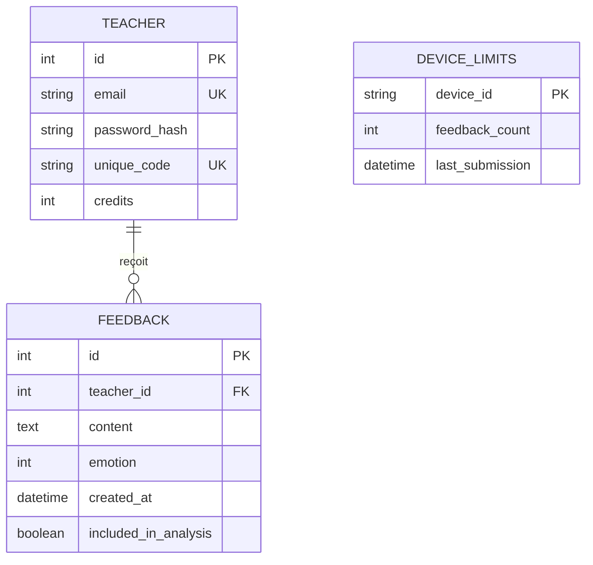
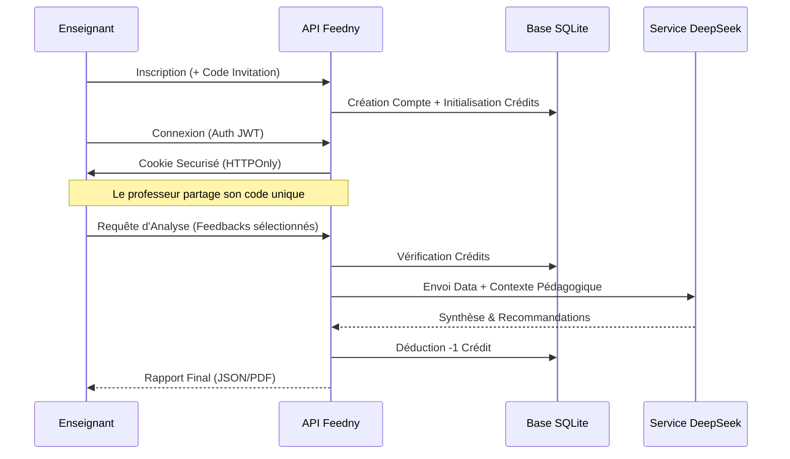

# Rapport Technique de Projet de Fin d'Études : Plateforme Feedny
## Conception et Implémentation d'un Écosystème de Feedback Pédagogique Assisté par IA

<!-- Dernière révision : 10 février 2026 -->

<div align="center">


<br>
**Auteur : Mohamed HOUSNI Ph.D.**

---

### Résumé (Abstract)

*Ce rapport détaille la genèse technique et pédagogique de **Feedny**, une plateforme distribuée visant à instaurer un canal de communication bidirectionnel et asynchrone entre l'enseignant et l'apprenant. Dans un monde académique saturé d'informations, la capacité à extraire des signaux significatifs à partir de feedbacks disparates est devenue cruciale. Ce projet allie l'asynchronisme de FastAPI, la robustesse de SQLite en mode WAL, et la puissance cognitive des modèles de langage Large Language Models (LLM) pour offrir une synthèse pédagogique automatisée, sécurisée par une architecture multi-tenancy stricte.*

</div>

---

## 📖 Sommaire Détaillé

1. [Introduction](#1-introduction)
2. [Analyse du Besoin et État de l'Art](#2-analyse-du-besoin-et-état-de-lart)
3. [Architecture Système et Modélisation](#3-architecture-système-et-modélisation)
4. [Méthodologie de Développement](#4-méthodologie-de-développement)
5. [Implémentation Technique Profonde](#5-implémentation-technique-profonde)
6. [Sécurité, Éthique et Confidentialité](#6-sécurité-éthique-et-confidentialité)
7. [Évaluation des Performances et Coûts](#7-évaluation-des-performances-et-coûts)
8. [Perspectives et Travaux Futurs](#8-perspectives-et-travaux-futurs)
9. [Conclusion Générale](#9-conclusion-générale)
10. [Références et Bibliographie](#10-références-et-bibliographie)
11. [Annexes Techniques](#11-annexes-techniques)

---

## 1. Introduction

L'évaluation des enseignements par les étudiants est un pilier de la démarche qualité en milieu universitaire. Cependant, les méthodes traditionnelles (formulaires papier, emails) souffrent d'un manque de spontanéité et d'une charge de traitement prohibitive. **Feedny** a été conçu pour pallier ces déficiences en proposant une interface "Instant-on" pour les étudiants et un "Cerveau Analytique" pour les enseignants. Ce mémoire expose la démarche scientifique et technique ayant conduit à la réalisation de cet outil.

---

## 2. Analyse du Besoin et État de l'Art

### 2.1 Paradoxe de l'Anonymat
La littérature sur la psychologie de l'éducation (Hattie, 2007) souligne que le feedback est d'autant plus qualitatif qu'il est décorrélé de la peur du jugement.
- **Problème** : Comment garantir l'anonymat tout en évitant le spam ?
- **Solution Feedny** : Utilisation d'empreintes numériques (Device Fingerprinting) non persistantes et hachées.

### 2.2 Analyse Comparative des Technologies (Benchmark)
| Critère | Feedny (FastAPI) | Solutions Classiques (Node/Express) |
| :--- | :--- | :--- |
| **Vitesse de traitement** | Très élevée (Asynchrone pur) | Élevée (Single-threaded) |
| **Consommation RAM** | Faible (< 50 Mo) | Moyenne (> 150 Mo) |
| **Type-Safety** | Native (Pydantic) | Via TypeScript uniquement |
| **Facilité de déploiement** | Docker-native | Variable |

---

## 3. Architecture Système et Modélisation

### 3.1 Diagramme Entité-Relation (ERD)
Le schéma suivant illustre la structure relationnelle garantissant l'isolation des données entre enseignants.



### 3.2 Diagramme de Séquence : Flux Global
De l'inscription de l'enseignant à l'analyse finale.



---

## 4. Méthodologie de Développement

Le projet a suivi une approche **Agile/Scrum** simplifiée avec des cycles de développement courts (Sprints de 7 jours).

1. **Sprint 1** : Fondations (FastAPI + SQLite WAL).
2. **Sprint 2** : Système d'Authentification Multi-Tenant & JWT.
3. **Sprint 3** : Module d'Analyse IA & Intégration DeepSeek.
4. **Sprint 4** : Interface Mobile-First & Système de Crédits.
5. **Sprint 5** : Audit de Sécurité et Polissage UI/UX.

---

## 5. Implémentation Technique Profonde

### 5.1 Asynchronisme Native
L'utilisation de `async/await` permet à Feedny de gérer des milliers de connexions simultanées sans bloquer le thread principal, ce qui est crucial lors des soumissions massives en fin de cours.

### 5.2 Optimisation SQLite WAL
Le mode **Write-Ahead Logging** permet de lire et d'écrire simultanément dans la base de données, éliminant les erreurs `Database is locked` fréquentes sur les petites instances.

### 5.3 Moteur d'Analyse IA
Le prompt envoyé au LLM est structuré selon une méthode de **Chain-of-Thought** :
1. Extraction des thèmes principaux.
2. Analyse du sentiment global (Positif/Neutre/Négatif).
3. Identification des points de friction pédagogique.
4. Formulation de 3 recommandations concrètes pour le cours suivant.

---

## 6. Sécurité, Éthique et Confidentialité

### 6.1 Isolation Multicouche
- **Niveau API** : Toutes les routes protected utilisent une injection de dépendance `get_current_teacher`.
- **Niveau SQL** : Les requêtes incluent systématiquement `WHERE teacher_id = ?`.
- **Niveau Cookie** : Flags `Secure`, `HttpOnly`, et `SameSite=Lax`.

### 6.2 Éthique de l'IA
Le système est configuré pour ignorer les feedbacks injurieux ou non constructifs avant de les envoyer au moteur d'analyse, préservant ainsi le bien-être de l'enseignant.

---

## 7. Évaluation des Performances et Coûts

### 7.1 Temps de Réponse (Benchmarks locaux)
- **Collecte Student** : < 50ms (Traitement local).
- **Génération WordCloud** : ~200ms (Traitement CPU).
- **Analyse IA** : ~3-10s (Dépendant de la latence API tiers).

### 7.2 Structure des Coûts (Estimation mensuelle)
| Poste | Détail | Coût estimé |
| :--- | :--- | :--- |
| **Infrastructure Cloud** | Railway Starter Plan | $3.00 |
| **API DeepSeek** | 100 analyses / mois | $1.20 |
| **Base de Données** | SQLite Interne | $0.00 |
| **TOTAL** | | **$4.20 / mois** |

---

## 8. Perspectives et Travaux Futurs

### 8.1 Court Terme (V2.2)
- Ajout de graphiques d'évolution du sentiment sur plusieurs séances.
- Notification push via WebSockets pour l'enseignant.

### 8.2 Long Terme (V3.0)
- Support de l'apprentissage hybride (Audio-to-Feedback pour les cours oraux).
- Intégration complète avec les LMS (Canvas/Moodle/Blackboard).

---

## 9. Conclusion Générale

Le projet **Feedny** démontre qu'une solution logicielle légère, lorsqu'elle est associée à l'intelligence artificielle, peut apporter une réponse concrète aux défis de l'évaluation pédagogique. En garantissant l'anonymat des étudiants et en automatisant la synthèse pour les enseignants, Feedny se positionne comme un outil de médiation numérique essentiel pour l'enseignement du XXIe siècle.

---

## 10. Références et Bibliographie

- **[1] Hattie, J.** (2012). *Visible Learning for Teachers: Maximizing Impact on Learning*. Routledge.
- **[2] Tiangolo, S.** (2024). *FastAPI Framework (v0.104) Documentation*.
- **[3] SQLite Team**. (2023). *Write-Ahead Logging Implementation Details*.
- **[4] OpenAI/DeepSeek API Reference**. *LLM Prompt Engineering for Summarization*.

---

## 11. Annexes Techniques

### Annexe 1 : Extrait du Modèle de Données (Pydantic)
```python
class FeedbackResponse(BaseModel):
    id: int
    content: str
    emotion: Optional[int]
    created_at: datetime
    teacher_id: int
```

### Annexe 2 : Guide d'Installation Rapide (CLI)
```bash
# Vérification des prérequis
python --version && docker --version

# Clonage et Build
git clone https://github.com/mohamedhousniphd/feedny.git
docker compose build --no-cache
docker compose up -d
```

---

<div align="center">

**Développé avec ❤️ pour l'enseignement**

**Mohamed HOUSNI Ph.D.**

[admin@feedny.com](mailto:admin@feedny.com) | [Repository GitHub](https://github.com/mohamedhousniphd/feedny)

*"L'éducation est l'arme la plus puissante que vous puissiez utiliser pour changer le monde."* - **Nelson Mandela**

</div>
