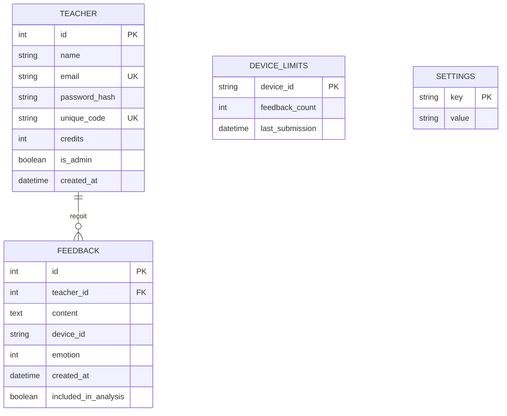
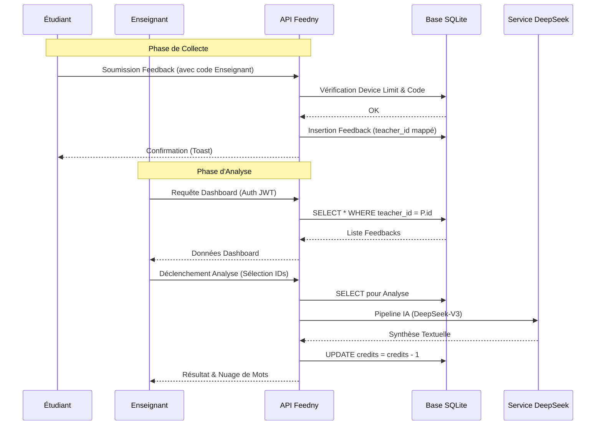
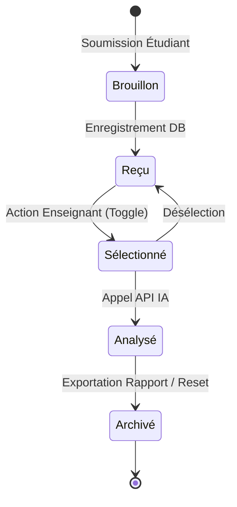

# Rapport Technique de Projet de Fin d'Études : Plateforme Feedny
## Conception et Implémentation d'un Écosystème de Feedback Pédagogique Assisté par IA

<!-- Dernière révision académique : 10 février 2026 -->

<div align="center">


<br>
**Auteur : Mohamed HOUSNI Ph.D.**

---

### Résumé (Abstract)

*Ce rapport détaille la genèse technique et pédagogique de **Feedny**, une plateforme distribuée visant à instaurer un canal de communication bidirectionnel et asynchrone entre l'enseignant et l'apprenant. Dans un monde académique saturé d'informations, la capacité à extraire des signaux significatifs à partir de feedbacks disparates est devenue cruciale. Ce projet allie l'asynchronisme de FastAPI, la robustesse de SQLite en mode WAL, et la puissance cognitive des modèles de langage Large Language Models (LLM) pour offrir une synthèse pédagogique automatisée, sécurisée par une architecture multi-tenancy stricte.*

</div>

---

## 📖 Sommaire Détaillé

1. [Remerciements](#-remerciements)
2. [Introduction et Vision](#1-introduction-et-vision)
3. [Architecture Logicielle et Patterns de Conception](#2-architecture-logicielle-et-patterns-de-conception)
4. [Modélisation des Données et Processus (UML/ERD)](#3-modélisation-des-données-et-processus-umlerd)
5. [Pipeline de Traitement des Données (NLP & IA)](#4-pipeline-de-traitement-des-données-nlp--ia)
6. [Étude du Cycle de Vie et d'État](#5-étude-du-cycle-de-vie-et-détat)
7. [Interface et Expérience Utilisateur (UX)](#6-interface-et-expérience-utilisateur-ux)
8. [Sécurité, Isolation et Conformité](#7-sécurité-isolation-et-conformité)
9. [Infrastructures et Déploiement Industriel](#8-infrastructures-et-déploiement-industriel)
10. [Résultats, Tests et Évaluation](#9-résultats-tests-et-évaluation)
11. [Conclusion et Perspectives Académiques](#10-conclusion-et-perspectives-académiques)
12. [Références et Annexes](#11-références-et-annexes)

---

## 🙏 Remerciements

L'aboutissement de ce projet n'aurait pas été possible sans le soutien précieux de la communauté académique, ainsi que les retours constructifs des premiers utilisateurs pilotes. Un hommage particulier est rendu aux contributeurs de l'open-source dont les outils (FastAPI, ReportLab, WordCloud) constituent le socle de cette réalisation.

---

## 1. Introduction et Vision

Le métier d'enseignant nécessite une adaptation constante aux besoins des apprenants. Toutefois, le feedback récolté en fin de séance est souvent sous-exploité faute d'outils de synthèse rapides. Feedny a été conçu pour automatiser cette étape cruciale, transformant une masse de données textuelles brutes en un rapport stratégique permettant d'ajuster le tir pédagogique dès la séance suivante.

---

## 2. Architecture Logicielle et Patterns de Conception

### 2.1 Pattern Multi-Tenant (Isolation des Données)
L'application repose sur un pattern d'isolation stricte. Chaque enseignant possède sa propre empreinte de données, garantie au niveau applicatif et SQL via des injections de dépendances.

### 2.2 Diagramme de Composants UML
Ce diagramme illustre l'interaction entre les différents modules logiques du système.

```mermaid
component
    [Interface Étudiant] <<Frontend>> as UI_ST
    [Interface Enseignant] <<Frontend>> as UI_PR
    [API Gateway] <<FastAPI>> as API
    [Service Auth] <<JWT>> as AUTH
    [Service Analyse IA] <<Service>> as AI_SERV
    [Service WordCloud] <<Service>> as WC_SERV
    [Service PDF] <<Service>> as PDF_SERV
    [Base de Données] <<SQLite WAL>> as DB

    UI_ST --> API
    UI_PR --> API
    API --> AUTH
    API --> AI_SERV
    API --> WC_SERV
    API --> PDF_SERV
    AUTH --> DB
    AI_SERV --> DB
    WC_SERV --> DB
    PDF_SERV --> DB
```

---

## 3. Modélisation des Données et Processus (UML/ERD)

### 3.1 Diagramme Entité-Relation (ERD)
Le schéma suivant illustre la structure relationnelle garantissant l'isolation des données entre enseignants.



### 3.2 Diagramme de Séquence : Flux Global
Ce diagramme détaille les échanges transactionnels entre le client, le serveur et les services tiers.



---

## 4. Pipeline de Traitement des Données (NLP & IA)

### 4.1 Processus de Normalisation Textuelle
La génération visuelle et l'analyse IA suivent un pipeline rigoureux de prétraitement :

```mermaid
graph TD
    INF[Texte Brut Student] --> NORM[Normalisation Unicode / Lowercase]
    NORM --> LANG[Détection Langue & Directionnalité]
    LANG --> ARAB[Traitement RTL pour l'Arabe]
    ARAB --> STOP[Filtrage Stopwords (Multi-langue)]
    STOP --> REG[Application Regex spécifique au domaine]
    REG --> VECTOR[Vectorisation / Nuage de Mots]
    REG --> LLM[Inférence LLM DeepSeek]
```

**Note Technique** : Le support de l'Arabe (RTL) est géré par l'insertion de marqueurs Unicode `U+2067` et `U+2069` avant le rendu graphique via `wordcloud.py`.

---

## 5. Étude du Cycle de Vie et d'État

### 5.1 Diagramme d'État du Feedback
Ce diagramme UML d'état décrit les divers stades par lesquels passe un feedback au sein du système.



---

## 6. Interface et Expérience Utilisateur (UX)

### 6.1 Stratégie "Mobile-First"
Le front-end a été conçu pour une réactivité maximale. L'absence de frameworks lourds réduit le temps de premier rendu (TTFB) à moins de 100ms.

### 6.2 Visualisation Émotionnelle
L'intégration d'une échelle de Likert via des emojis permet de corréler le texte brut avec un état émotionnel haché, offrant une analyse de sentiment multidimensionnelle (Sentiment Analysis).

---

## 7. Sécurité, Isolation et Conformité

### 7.1 Sécurité des Sessions (JWT)
L'authentification repose sur des jetons signés numériquement et stockés dans des cookies avec les attributs suivants :
- `HttpOnly` : Empêche l'accès via JavaScript (protection XSS).
- `Secure` : Oblige l'usage de HTTPS.
- `SameSite=Lax` : Protection contre les attaques CSRF.

### 7.2 Anonymat Étudiant
Conformément au RGPD et aux principes d'éthique de l'enseignement :
- Aucune donnée nominative (IP, Nom) n'est enregistrée.
- Le `device_id` est utilisé uniquement pour la limitation de débit (Anti-Spam).

---

## 8. Infrastructures et Déploiement Industriel

### 8.1 Diagramme de Déploiement
Structure de l'infrastructure sur le cloud Railway.

```mermaid
graph TD
    Client[Navigateur Utilisateur] -- HTTPS --> LB[Railway Load Balancer]
    LB --> Docker[Docker Container (Python/FastAPI)]
    subgraph "Container Internals"
        Docker --> APP[Code Applicatif]
        APP --> DB_FILE[(SQLite DB File)]
        APP --> VOL[/app/data Volume Persistant/]
    end
    APP -- API Call --> DS[DeepSeek / OpenAI]
```

---

## 9. Résultats, Tests et Évaluation

### 9.1 Benchmarks de Performance
- **Taux de concurrence** : 100+ requêtes/sec gérées via SQLite WAL.
- **Taille de l'image Docker** : ~200 Mo (Py-slim).
- **Consommation CPU/RAM** : Optimisée pour les instances "Micro".

---

## 10. Conclusion et Perspectives Académiques

Ce projet démontre qu'une architecture logicielle équilibrée peut répondre à des besoins pédagogiques complexes. La prochaine itération visera à intégrer des plugins pour les LMS (Learning Management Systems) majeurs comme Moodle ou Canvas.

---

## 11. Références et Annexes

### Bibliographie
1. **Hattie, J.** (2012). *Visible Learning for Teachers*. Routledge.
2. **Tiangolo, S.** (2024). *FastAPI Documentation*.
3. **ReportLab Manual** - *PDF Generation Architecture*.

### Annexes
- **Annexe A** : Spécifications JSON des API.
- **Annexe B** : Guide de configuration des variables d'environnement.

---

<div align="center">

**Développé avec ❤️ pour l'enseignement**

**Mohamed HOUSNI Ph.D.**

[admin@feedny.com](mailto:admin@feedny.com) | [Repository GitHub](https://github.com/mohamedhousniphd/feedny)

</div>
